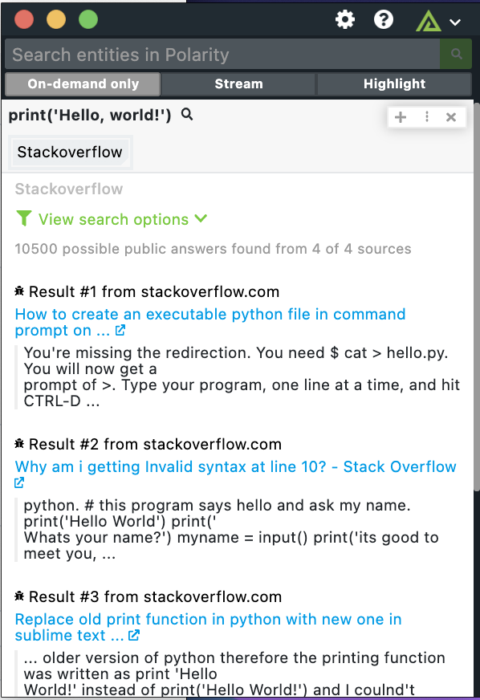

# Polarity Stackoverflow Integration

The Polarity Stackoverflow integration uses the Google search API to search to search for code examples on stackoverflow.

* Stackoverflow
* Stackexchange
* Serverfault
* Superuser

## Stackoverflow Integration Options

### API Key

Valid Google CSE API Key

### Search String

Add search clause to filter search results even more such as "Javascript OR PYTHON" without the quotes.

## Installation Instructions

Generate a new CSE API key on the following page:

https://developers.google.com/custom-search/v1/overview

A free account allows for up to 100 search queries per day.

Once the API key has been generated, input the information into the API Key field in the integration and start searching for exploits. 

## Polarity

Polarity is a memory-augmentation platform that improves and accelerates analyst decision making.  For more information about the Polarity platform please see:

https://polarity.io/
